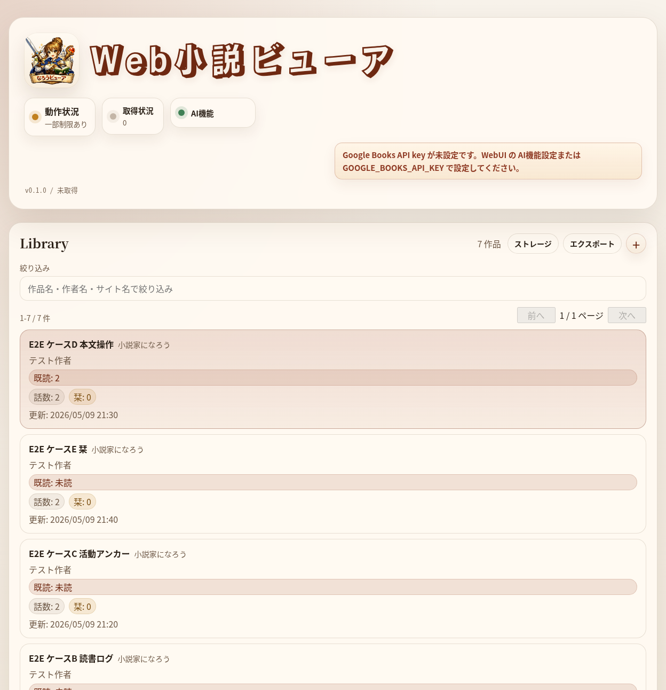
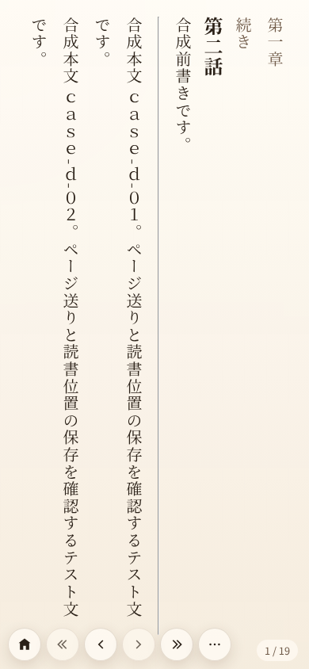
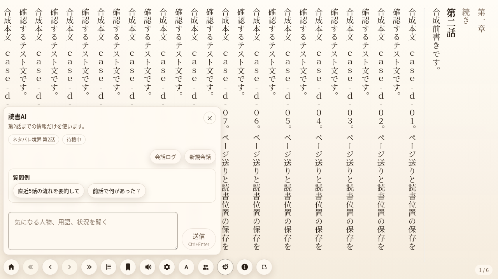
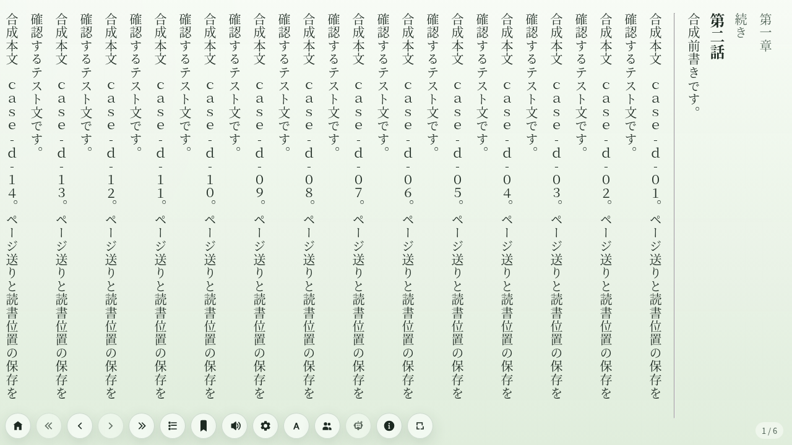
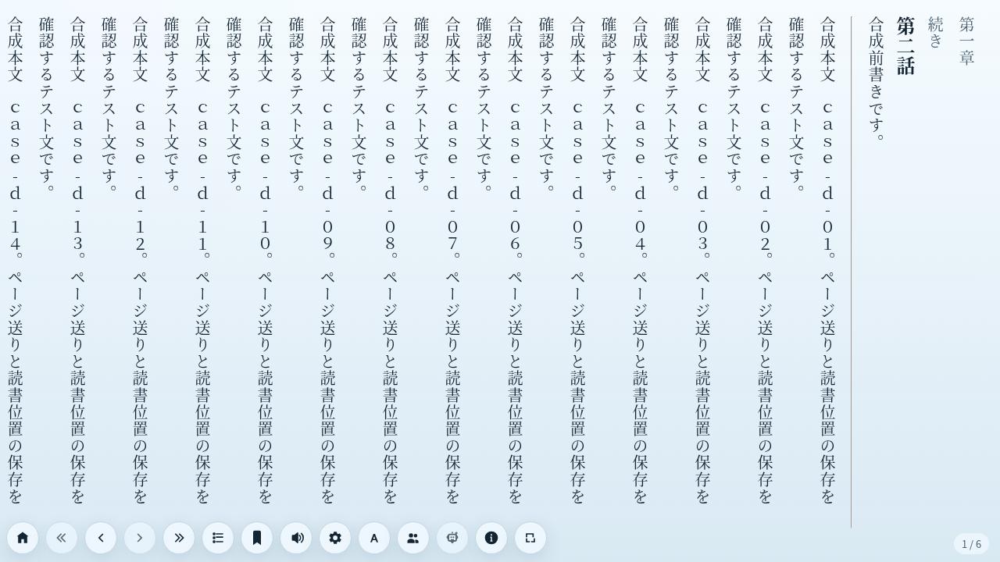
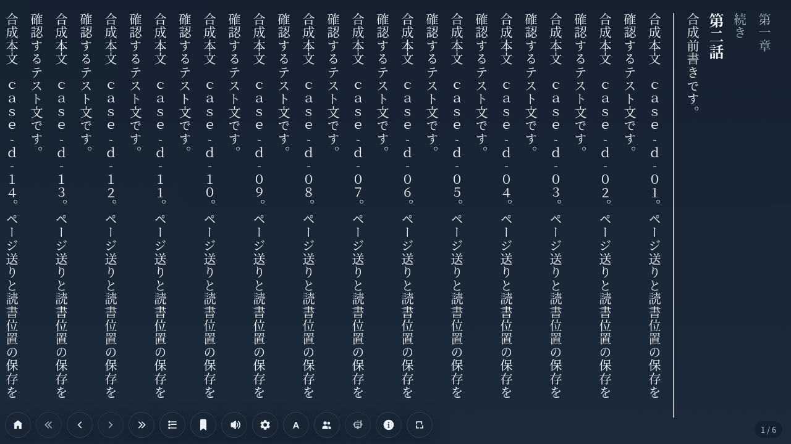

# narou-viewer


narou-viewer is an unofficial self-hosted web novel viewer for personal reading
workflows.

narou-viewer は、Web 小説を自分の環境に保存し、ライブラリ管理、リーダー、栞、読書位置、AI 支援機能をまとめて扱う個人利用向け self-hosted viewer です。

## 主な機能

- 小説家になろう / カクヨム作品の取得 sidecar と連携したローカルライブラリ管理
- PC / スマホ / タブレット向けの本文リーダー
- 取得済み本文 HTML の表示用整形と、段落、ルビ、画像の reader 向け正規化
- 縦書き / 横書き、文字サイズ、行間、余白などの組版調整
- 明暗テーマや紙面テーマの切り替え、本文フォントの切り替え
- 話単位の既読位置、栞、読書状態の保存
- オフライン読書用のブラウザローカルキャッシュ
- 作品ごとのストレージ使用量表示
- AI 生成のキャラクター一覧と、AI チャットによる小説内容の確認・整理
- 書籍化情報やカバー候補を扱う publication 情報表示

本文内容を校閲したり別の文章へ改変したりするものではなく、保存済み HTML を読書画面で扱いやすい形に整えます。

## スクリーンショット

合成 fixture を使った画面例です。

<!-- markdownlint-disable MD033 -->

ライブラリ画面では、保存済み作品、読書状態、取得状況、AI 機能の状態を一覧できます。



スマホ幅の本文表示では、縦書き本文、ページ送り、下部の読書操作を片手で扱えるようにしています。



読書AIパネルでは、開いている話数までをネタバレ境界として、作品内の人物や状況を確認できます。



本文画面は、明るさや色味の異なるテーマへ切り替えられます。

森林テーマ:



深海テーマ:



ミッドナイトテーマ:



<!-- markdownlint-enable MD033 -->

## 利用上の注意

narou-viewer は非公式ツールです。小説家になろう、カクヨム、株式会社ヒナプロジェクト、株式会社KADOKAWA とは無関係です。

- 小説家になろう / カクヨム等の実サイト fetcher は、利用者自身の責任で、各サイトの利用規約と権利者の条件に従って使ってください。
- 取得済みデータを公開、共有、再配布する用途を想定していません。
- 実サイトへの高頻度アクセスや機械的な連続取得を避けてください。実装上の rate limit / retry / timeout / cancel は維持しますが、利用時のアクセス頻度にも注意してください。
- cloud LLM 連携は opt-in です。API key を設定しない状態では外部 LLM provider への生成リクエストは行いません。
- AI 機能を有効化した場合、設定した外部 LLM provider に本文またはその抜粋・要約用テキストが送信される場合があります。

## クイックスタート

[`docker-compose.prod.yml`](docker-compose.prod.yml) は、ローカルまたは任意の self-host 環境で試せる compose サンプルです。TLS や認証は含まないため、公開する場合は前段の reverse proxy、VPN、tunnel などで設定してください。

```bash
docker compose -f docker-compose.prod.yml up --build
```

既定では同一 host の `http://localhost:8080` で開けます。ポートを変える場合は次のように指定します。

```bash
NAROU_VIEWER_HTTP_PORT=18080 docker compose -f docker-compose.prod.yml up --build
```

既定では `reverse-proxy` を host の `127.0.0.1:8080` に bind します。公開 host では前段の reverse proxy、VPN、tunnel などから転送してください。外部 interface へ直接 bind する場合は、TLS と認証を別途設定したうえで `NAROU_VIEWER_HTTP_BIND=0.0.0.0` を明示してください。

compose の主な service:

- `reverse-proxy`: Nginx。HTTP で `viewer-web` と `/api/*` を同一 origin にまとめます。
- `viewer-web`: `deploy/viewer-web/Dockerfile` で build した静的ファイル配信
- `viewer-api`: `deploy/viewer-api-go/Dockerfile` で build した API service
- `novel-fetcher`: 取得 sidecar。既定の取得 backend として viewer-api から使います。
- `shared-data-init`: 初回起動時に `shared-data` の必要ディレクトリと所有者を整える one-shot service。
- `shared-data`: `viewer-api` と `novel-fetcher` が共有する named volume

注意:

- `shared-data` は初期状態では空です。起動時に `shared-data-init` が `/data/novel-fetcher` と `/data/state` を作成し、non-root container から書き込める所有者へ補正します。
- `novel-fetcher` の `33006` は publish しません。取得 sidecar 連携は `viewer-api` の `/api/fetcher/*` 経由で扱います。
- `novel-fetcher` の既定 User-Agent は実サイト互換性のため browser-like な値です。ツール名を識別できる UA は既定では送りません。利用者の運用方針に応じて、compose の `.env` や shell environment から `NOVEL_FETCHER_USER_AGENT` で上書きできます。
- この compose 自体は TLS や認証を終端しません。インターネットへ公開する場合は、Caddy、Traefik、Nginx、Cloudflare Tunnel、VPN など任意の前段で TLS と認証を設定してください。
- AI / Google Books 連携に必要な任意 env は、shell か compose の `.env` から渡せます。API key を設定しなければ cloud LLM provider への生成リクエストは行いません。

## ドキュメント

- 入口: [`docs/README.md`](docs/README.md)
- アーキテクチャ: [`docs/architecture.md`](docs/architecture.md)
- 機能別仕様: [`docs/character-summary.md`](docs/character-summary.md), [`docs/publication-info.md`](docs/publication-info.md), [`docs/reader-ai-assistant.md`](docs/reader-ai-assistant.md), [`docs/state-schema-policy.md`](docs/state-schema-policy.md)
- 開発手順: [`docs/development.md`](docs/development.md)
- テスト方針: [`docs/testing/testing-strategy.md`](docs/testing/testing-strategy.md), [`docs/testing/e2e-setup.md`](docs/testing/e2e-setup.md)
- self-host とデプロイ方針: [`docs/deployment.md`](docs/deployment.md)
- AI 実験・評価手順: [`docs/ai-experiments.md`](docs/ai-experiments.md)
- エージェント向け手順: [`docs/README.md` の Skills 索引](docs/README.md#エージェント向け-skills)

## 開発

日常的な確認では、まず lint と高速テストを実行します。

```bash
bun run lint
bun run test:unit
```

build まで含めて確認する場合:

```bash
bun run verify:fast
```

E2E まで含めた最終確認:

```bash
bun run verify
```

`novel-fetcher` を変更した場合:

```bash
bun run verify:novel-fetcher
```

Dev Container、worktree、toolchain、E2E fixture の詳細は [`docs/development.md`](docs/development.md) を参照してください。

## プロジェクト構成

- `apps/viewer-api-go`: viewer-api。開発 / E2E / self-host compose の既定 API
- `apps/viewer-web`: React + Vite + TypeScript
- `services/novel-fetcher`: 取得 sidecar
- `.devcontainer/`: Dev Container 定義
- `docs/`: 設計、開発、運用、テスト、機能別仕様
- `.agents/skills/`: エージェント向けの反復手順

## ライセンス

MIT License です。

関連ファイル:

- [`LICENSE`](LICENSE)
- [`NOTICE.md`](NOTICE.md)
- [`SECURITY.md`](SECURITY.md)
- [`CONTRIBUTING.md`](CONTRIBUTING.md)
