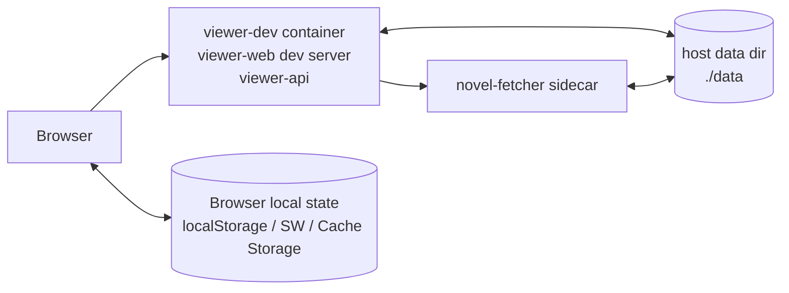
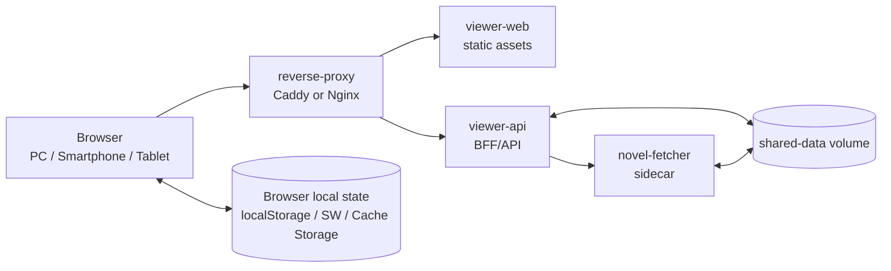

# narou-viewer アーキテクチャ

## 1. 目的

- narou-viewer の主要サービス、データ境界、API 境界を定義する。
- `novel-fetcher` を取得 backend とする。
- 開発構成と self-host 構成を分けて説明する。

## 2. 全体構成

### 2.1 開発構成



- `viewer-web` と `viewer-api` は Dev Container の `viewer-dev` 内でプロセスとして起動する。
- `novel-fetcher` と E2E 用常駐サービスは sidecar コンテナとして起動する。
- 共有実データはホストの `./data` を介して共有する。
- 現行の app-shell fallback cache はブラウザ内に保持する。話本文のオフライン事前取得は未実装である。

### 2.2 self-host 構成



## 3. ランタイム構成

### 3.1 開発時コンテナ

| コンテナ                    | 役割                                                           | 公開ポート         | 永続化                                | 備考                                                                       |
| --------------------------- | -------------------------------------------------------------- | ------------------ | ------------------------------------- | -------------------------------------------------------------------------- |
| `viewer-dev`                | `viewer-web` / `viewer-api` 開発実行環境                       | `5173`, `8080`     | リポジトリ bind mount                 | `bun run dev` を実行                                                       |
| `novel-fetcher`             | 取得 sidecar。小説家になろう / カクヨムの基本取得に対応        | 内部のみ (`33006`) | `./data/novel-fetcher` bind mount     | 既定の取得 backend として viewer-api から利用                              |
| `novel-fetcher-e2e`         | E2E 用 `novel-fetcher`                                         | 内部のみ (`33006`) | `./data_e2e/novel-fetcher` bind mount | `viewer-api-e2e` の既定取得 backend                                        |
| `viewer-api-e2e`            | E2E 用 API                                                     | `18080`            | リポジトリ bind mount                 | `viewer-dev` 起動時に常駐。`viewer-api` を起動                             |
| `viewer-web-e2e`            | E2E 用 web                                                     | `15173`            | リポジトリ bind mount                 | `viewer-dev` 起動時に常駐。workspace の Bun 依存導入後に dev server を開始 |

`viewer-api` は人物・用語抽出と読書AI応答を process 内で扱う。HTTP 層は request / response / streaming event の変換に留め、読書AIの agent loop・tool 実行・usage 記録と抽出 job の状態遷移は application service が担う。

`data_e2e` は E2E 専用の作業コピーとして扱い、通常のテスト実行では `data/` から再生成しない。git 管理する fixture 正本は `tests/fixtures/e2e/` に置き、初期化時に `data_e2e` へ展開する。fixture の初期化や明示的な再生成手順は `README.md` に記載する。

### 3.2 self-host サービス

- `reverse-proxy`: 入口、静的配信、API ルーティングを担当する。sample では `127.0.0.1:8080` に bind し、TLS / 認証は利用者の前段で扱う。
- `viewer-web`: レスポンシブ UI、縦書きビューア、Service Worker を配信する。
- `viewer-api`: BFF/API、state 管理、AI 生成を担当する。`shared-data` volume を読み書きする。
- `novel-fetcher`: 取得 sidecar として内部 network で動作する。保存データは `shared-data` volume の `/data/novel-fetcher` に置く。

`viewer-api` の internal AI module が OpenRouter 接続と prompt / response normalization を担う。

### 3.3 共有データパス契約

- 共有する物理データルートは 1 つだけとする。
  - 開発: リポジトリ直下の `./data`
  - self-host: named volume `shared-data`
- 共有データルートのコンテナ内パスはサービスごとに異なる。
  - `viewer-api`: `VIEWER_API_DATA_DIR`。開発時既定値は `/workspace/data`
  - `novel-fetcher`: `/data/novel-fetcher`
- `viewer-api` は `novel-fetcher` コンテナ側の内部パスを参照しない。
- `viewer-api` は作品一覧・目次・本文を `novel-fetcher` の内部 API 経由で参照する。保存済み asset 配信だけは、ブラウザへ同一 origin の cacheable URL を返すため、`VIEWER_DATA_DIR/novel-fetcher` 配下の共有ファイルを path traversal / symlink escape 検証後に返す。
- 共有データルート直下の論理構造は次の通りとする。

```text
<shared-data-root>/
  novel-fetcher/
    library.sqlite
    works/
      <site>/
        <siteWorkId>/
          episodes/
          raw/
          assets/
  state/
```

## 4. 論理構成

narou-viewer は、UI、API、取得 sidecar、共有データ、ブラウザローカル状態を分けて扱う。

- `viewer-web`
  - ライブラリ一覧、本文リーダー、栞、表示設定、読書AIパネルなどの UI を担当する。
  - `localStorage` に端末依存の reader 設定を保存する。Service Worker / Cache Storage は現行では app shell の navigation fallback を担当し、話本文とその metadata のオフライン保存は未実装である。
- `viewer-api`
  - ブラウザ向け BFF/API として、作品一覧、目次、本文、栞、既読位置、AI 生成、ストレージ使用量を提供する。
  - `state/*.yaml`、`state/*.sqlite` を管理し、取得 sidecar の内部 API を呼び出す。
  - HTTP request / response の整形、入力検証、ETag、streaming response を担当し、複数 domain に跨る処理は application service に分ける。
- `novel-fetcher`
  - 小説サイトからの取得、更新、削除、保存データの索引を担当する。
  - `library.sqlite` と `works/**` を所有し、`viewer-api` から内部 network 経由で利用される。
  - `library.sqlite` の未知 migration と canonical episode の未知 `schema_version` は、write / API 応答前に拒否する。version、復旧、consistency group の正本は [`state-schema-policy.md`](state-schema-policy.md) とする。
- `shared-data`
  - `novel-fetcher` の保存データ、server state、AI 利用統計、読書AI検索キャッシュを保持する。
  - repository には保存せず、開発時は `data/`、self-host 時は named volume として扱う。
- ブラウザローカル状態
  - `localStorage` に端末依存の reader 設定を保持する。
  - Service Worker / Cache Storage に `/` と manifest の app-shell cache を保持する。
  - server state と同期する必要がある既読位置や栞は `viewer-api` に保存する。

## 5. データ境界と責務分離

### 5.1 `novel-fetcher` が管理

- `novel-fetcher/library.sqlite`
  - `fetch_tasks` が取得要求・状態・進捗・制御要求、`fetch_task_queue` が queue 順序、`fetch_task_episode_checkpoints` が task 内の episode 完了実績を保持する。
  - 一括取得・更新 API は受理時に分割し、永続 task は 1 target または 1 work ID だけを処理する。
  - process 再起動時は `queued` だけを queue へ復帰し、旧 `running` は `succeeded` / `canceled` / `interrupted` のいずれかへ recovery してから worker を起動する。
  - `/api/v2/system/queue` の `total` は `queued + running` を表し、`paused` / `interrupted` は自動実行対象外の件数として別に返す。
- `novel-fetcher/works/**/episodes/*.json`
  - canonical episode として本文ブロックに加え、取得元の話単位 `source_url` も保持する
- `novel-fetcher/works/**/raw/episodes/*.html`
- `novel-fetcher/works/**/assets/**`

### 5.2 `viewer-api` が管理

- `state/reading_state.yaml`
- `state/bookmarks.yaml`
- `state/reader_preferences.yaml`
- `state/novel_reader_settings.yaml`
- `state/ai_generation_settings.yaml`
- `state/publications.yaml`
- `state/character_events/*.yaml`
  - AI 生成キャラクター一覧の差分更新用正本。安定した character id、削除・merge 済み ID、名前・full name・gender を含む人物履歴、言及、未解決 mention、処理済み episode の `contentEtag` を保持し、長編作品では生成済み範囲以降だけを追加処理する。
- `state/character_profiles/*.yaml`
  - reader API/UI 向けの materialized view。削除や破損時は AI 生成分について `character_events` から再構築できる。
  - 再構築は events の processed index が現在の profile 以上の場合だけ行い、より新しい heuristic profile を古い AI events で巻き戻さない。
  - AI 生成分の保存、materialize、クリアは小説単位で直列化し、正本と materialized view の逆転を避ける。
- `state/term_profiles/*.yaml`
  - reader API/UI 向けの用語履歴。公開時は character commit frontier 以下に制限する。
- `state/extraction_jobs/*.yaml`
- `state/extraction_jobs/index/*.yaml`
- `state/extraction_jobs/checkpoints/*.json`
- `state/ai_usage.sqlite`
  - 読書AIなどの AI 利用統計を run / request 単位で保持する再生成不能な監査・利用履歴。
  - producer が組み立てた分析用 JSON snapshot も保存する。現行の読書AIは `message` / `history` / `answer` の本文を会話用の専用 field としては保存せず、会話件数と文字数、tool 名・概要、件数・深さ・文字列長を制限した tool request / result、usage request、生成 mode / reasoning 設定を記録する。
  - 制限付き tool I/O には、モデルが `query` や `summaryFocus` へ転記したユーザー文言・検索語と、tool が返した作品本文の excerpt / snippet / passage、local summary、人物・用語情報が含まれ得る。件数・深さ・文字列長の制限は内容の redaction ではない。
  - usage store 自体は snapshot をそのまま JSON 化し、credentials 系 key の汎用 redaction は行わない。現行 producer は AI credential を snapshot に含めない構造を組み立てており、新しい producer にも credential 非包含または明示的 redaction と test を要求する。
- `state/reader_search.sqlite`
  - 読書AI `search_full_text` 用の plain text cache。`novel_id`、`episode_index`、`content_etag` をキーにし、検索時の lazy fill と本文閲覧時の write-through で更新する。
  - 取得済み本文と reader document から再生成できる派生キャッシュであり、破損・削除時も読書状態や AI 設定の正本には影響しない。

### 5.3 `viewer-web` / ブラウザが管理

- library export の交換 schema
- reader の端末依存設定値（文字サイズ、文字間隔、読み上げ等）を `localStorage` に保存
- app-shell navigation fallback 用の Service Worker / Cache Storage
- reader 同期用の `clientId`（タブ/PWA ウィンドウごとにメモリ上で生成し、storage には永続化しない）

### 5.4 競合回避ルール

- `viewer-api` は `novel-fetcher/works/**` に直接書き込まない。作品更新は必ず選択中の取得 backend API 経由で実行する。
- 作品更新は `novel-fetcher` API を使う。
- `state/*` は `viewer-api` のみが更新する。
- `viewer-api` 内では `FileStateStore` facade が state 更新を直列化し、`reading_state.yaml` / `bookmarks.yaml` / `reader_preferences.yaml` / `novel_reader_settings.yaml` の schema と単一 file 更新は各 Repository が所有する。
- reader state / reader preferences / bookmarks のような単一 state file に閉じた薄い CRUD は、route handler 近くで request validation を行い `FileStateStore` facade を呼ぶ。取得 backend 削除後の state pruning、publication cover 合成、reader correction 適用、AI usage coordination のように複数 domain を跨ぐ処理は application service へ切り出す。
- YAML / JSON などの file state 書き込みは、共通の atomic file helper を通して「最新読込 -> メモリ上で変更 -> temp file -> fsync -> rename -> parent dir fsync」で行う。
- `state/ai_usage.sqlite` は AI 利用履歴専用の例外であり、`AiUsageStore` が SQLite transaction と process 内 write mutex で更新する。既存 DB の supported migration は viewer-api 起動時に適用し、read path は read-only connection で version と schema を検証する。未知の将来 version では startup / read / write / prune を停止する。cold backup を単一 main file に保つため `journal_mode=DELETE` を明示する。`state/reader_search.sqlite` は `PRAGMA user_version` で table schema と本文正規化 contract を一体管理する再生成可能 cache であり、version mismatch / corruption は connection close 後に旧 DB を quarantine して lazy rebuild する。
- `viewer-api` を複数インスタンスに増やす場合、YAML 単体および単一 SQLite ファイルでは整合性保証が不足するため、外部ロックまたは外部ストアへ移行する。
- 個別 schema の version、互換性、migration、prune、backup / restore は [`state-schema-policy.md`](state-schema-policy.md) を単一正本とする。

## 6. API 境界（viewer-api）

- 命名規約: API の `{episodeIndex}` は `toc.yaml` の `episode_index` または `index` に対応する 10 進数字文字列を指す。
- Web client は `/api/*` への共通 request header として `x-narou-viewer-api-contract-version` と `x-narou-viewer-client-build` を送る。`viewer-api` は unsafe method の `/api/*` mutation で現行 contract version を要求し、古い client には `426`、`CLIENT_UPDATE_REQUIRED`、`x-narou-viewer-reload-required: 1` を返して PWA / stale bundle の更新を促す。
- JSON error response は原則 `error`, `code`, `message`, 任意の `details`, `requestId` を含む共通 envelope で返す。`viewer-api` は `/api/*` response に `X-Request-Id` を付与し、client が valid な `X-Request-Id` を送った場合は同じ値を応答 header と error body の `requestId` に反映する。

### 6.1 取得 sidecar API 連携

- 現行既定の sidecar は `novel-fetcher` であり、`viewer-api` からの内部 API 呼び出しと `VIEWER_DATA_DIR/novel-fetcher` 配下のデータ更新を担う。
- ブラウザ操作は原則 `viewer-web` -> `viewer-api` -> 取得 sidecar で扱う。
- 一覧・目次・本文を `novel-fetcher` の内部 API 経由で参照する。asset 配信だけは `viewer-api` が `VIEWER_DATA_DIR/novel-fetcher` 配下の保存済みファイルを検証して返す。
- `viewer-api` の取得 sidecar 操作用 API は `/api/fetcher/*` とする。旧 `/api/narou/*` 互換 API は廃止済みで、現行 frontend / contract test / 正本 docs は `/api/fetcher/*` だけを公開 BFF として扱う。実体は `novel-fetcher` sidecar への中継で構成し、取得 backend 側 work 削除が成功した後は、`viewer-api` が reader state / bookmarks / character state / AI usage の孤立 state を novel 単位で pruning する。
- `novel-fetcher` の内部 API は、保存済み work の読み取りに `/api/v1/works...`、取得・更新・削除・task 操作に `/api/v2/...` を使う。これは sidecar 内部 API の分割であり、ブラウザへ直接公開する API バージョンではない。
- task の運用正本は `library.sqlite` 内の task table とする。`taskqueue.Queue` は永続 repository と wake 通知をまとめるだけの adapter とし、runner は実行中 task の cancellation signal だけを memory に保持する。同一 task の episode 保存と checkpoint 更新は SQLite transaction で確定する。
- fetcher 操作 option は camelCase の request DTO で受ける。`force`、`forceRedownload`、`skipUnchanged` は `novel-fetcher` の実行経路へ反映する。`convertAfterDownload`、`mail`、`includeFrozen`、`convertAfterUpdate` は現行 `novel-fetcher` では未対応のため、true 指定時は 501 として拒否する。

### 6.2 `viewer-api` 提供 API

- `GET /api/system/status`
  - `viewer-api` / 取得 sidecar / ローカルライブラリの稼働状況をトップ画面向けに集約返却
- `GET /api/fetcher/status`
  - 取得 sidecar の `/api/v2/system/version` / `/api/v2/system/queue` / `/api/v2/tasks/summary` を viewer 向けに集約返却
- `GET /api/fetcher/queue`
  - 取得 sidecar の `/api/v2/system/queue` を queue polling / UI 表示向けに返す最小 BFF
- `GET /api/fetcher/tasks/summary`
  - 取得 sidecar のタスク状況を polling 用に camelCase DTO で返す最小 BFF
- `POST /api/fetcher/works/download`
  - N コードまたは作品 URL を受け取り、新規ダウンロードを取得 sidecar へ中継する
- `POST /api/fetcher/works/update`
  - viewer 側の `novelId` を取得 backend 側の小説 ID に解決して更新を依頼する。キュー投入成功時は 202 を返す
- `POST /api/fetcher/works/resume`
  - viewer 側の `novelId` を取得 backend 側の小説 ID に解決して、失敗または途中停止した取得 backend 側 work の再開を依頼する
- `POST /api/fetcher/works/remove`
  - viewer 側の `novelId` を取得 backend 側の小説 ID に解決して削除を依頼する。削除成功後は reader state / bookmarks / character state / AI usage の孤立 state を pruning する
- `POST /api/fetcher/tasks/{taskId}/cancel`
  - 更新 UI からのキャンセル操作を取得 backend へ中継する
- `POST /api/fetcher/tasks/{taskId}/pause`
  - queued task は即時に一時停止し、running task は制御要求を永続化してから実行中 context を停止する
- `POST /api/fetcher/tasks/{taskId}/resume`
  - paused / interrupted / failed task を同じ task ID のまま queue 末尾へ戻す
- `GET /api/system/storage`
  - サーバ側 `data/` 配下の現行データのファイル論理サイズを走査し、`小説データ` / `キャッシュ` / `その他` のカテゴリ別合計と、作品単位の合計・内訳を返す
  - 旧作品データのディレクトリは走査・集計の対象外とする
  - 容量集計上は `novel-fetcher/works/**/episodes` と `assets` を小説データ、`raw` と `state/reader_search.sqlite*` をキャッシュへ分類する。raw HTML は同一 bytes の再取得を保証できないため、backup 上の扱いは [`state-schema-policy.md`](state-schema-policy.md) を優先する。分類できない管理ファイルはその他に含める
- `GET /api/system/storage/progress`
  - 直近のストレージ使用量走査について、処理状態と作品数単位の目安進捗を返す
- `GET /api/library/novels`
  - 一覧表示向けに共有データルート上の作品情報を一次ソースとして state を合成
- `GET /api/library/novels/{novelId}/toc`
  - `toc.yaml` を整形返却
  - 右ペインの作品詳細表示用に `story` を含める
  - `episodes` の順序は `toc.yaml` の記載順を維持する
  - 各話に `episodeIndex`, `title`, `sourceUrl`, `updatedAt`, `contentEtag` を含める
- `GET /api/library/novels/{novelId}/episodes/{episodeIndex}`
  - 選択中 backend の本文を HTML と reader 向け構造化 document に変換して返却
  - レスポンスに `sourceUrl`, `html`, `readerDocument`, `plainTextLength`, `updatedAt`, `contentEtag` を含める

- `PUT /api/reader/state`
  - リクエスト body は `novelId`, `lastReadEpisodeIndex`, `position`, `expectedStateVersion` と、任意の `clientId`, `scroll` を受け取り、作品ごとの最終既読話（`episode_index`）と本文位置を CAS で更新する
  - `expectedStateVersion` は対象作品の現在 `stateVersion` と一致する非負整数を必須とし、省略・`null`・負数・不一致は書き込まない
  - version 不一致時は `409` と現在の Reader State（`novelId`, `lastReadEpisodeIndex`, `position`, `updatedAt`, `stateVersion`, `updatedByClientId`）を返す
- `GET /api/reader/state?novelId=...`
- `GET /api/reader/preferences`
- `PUT /api/reader/preferences`
  - リクエスト body は `readingMode`, `fontFamily`, `theme` を受け取り、reader の端末非依存設定を更新する
- `POST /api/bookmarks`
  - リクエスト body は `episodeIndex` と `position` を受け取り、話内の保存位置を保持する
- `DELETE /api/bookmarks/{bookmarkId}`
- `GET /api/bookmarks?novelId=...`
- `POST /api/library/novels/{novelId}/reader-assistant/chat`
  - 読書AIの非 streaming 応答。現在話、ユーザー発話、直近会話履歴を受け取り、`viewer-api` 内の agent loop で必要な読書文脈 tool を実行して最終回答を返す
- `POST /api/library/novels/{novelId}/reader-assistant/chat/stream`
  - 読書AIの streaming 応答。`application/x-ndjson` で `status` / `tool_call` / `tool_result` / `result` / `error` を返し、クライアントの実行ログ表示に使う
- `GET /api/ai-generation/usage`
  - 読書AIなどの保存済み AI 利用統計を返す。schema は run / request ごとの token、cost、request kind、親 request、tool 名・概要を表現できるが、producer が取得しない値は `0` または未設定となる。現行の読書AI producer は `tool_call` / `final_answer`、input / output / total tokens、tool 名・概要を保存し、cost、cached / reasoning tokens、親子 request は投入しない
- `GET /api/ai-generation/usage/:runId`
  - 指定 run の統計詳細と producer 定義の分析用 JSON snapshot を返す。現行の読書AI snapshot は会話本文を専用 field としては保存しないが、上限付き tool request / result に転記されたユーザー文言や作品本文の excerpt / snippet / passage が含まれ得る。provider の raw response body や `finish_reason` は snapshot に保存しない一方、失敗 run の `errorMessage` には provider 由来の error 文言が含まれ得る。usage store に key 名・内容ベースの汎用 redaction はない

### 6.3 話本文のバージョニングとキャッシュ無効化

- `contentEtag` は、`novel-fetcher` sidecar が返す `content_hash` を優先し、不足時は本文メタデータから作る安定キーとする。
- 現行 `viewer-web` は `contentEtag` や話本文を browser storage に永続化せず、Service Worker も episode API を cache しない。
- 将来、話本文のオフライン cache を実装する場合は、保存した `contentEtag` と `toc` / 本文 API の値を比較し、変更済みの話を再取得する。
- 実装が容易なら HTTP `ETag` / `If-None-Match` も併用する。

## 7. 主要シーケンス

### 7.1 一覧表示

1. `viewer-web` -> `viewer-api`: `GET /api/library/novels`
2. `viewer-api` -> 取得 backend: 作品一覧と目次情報を取得
3. `viewer-api` -> `state/*.yaml`: 既読/栞をマージ
4. `viewer-api` -> `viewer-web`: 一覧DTO返却

### 7.2 話本文表示

1. `viewer-web` -> `viewer-api`: `GET /api/reader/preferences`
2. `viewer-web`: ブラウザローカルから reader の端末依存設定（文字サイズ、文字間隔）を読み込む
3. `viewer-web` -> `viewer-api`: `GET /api/library/novels/{novelId}/toc`
4. `viewer-web` -> `viewer-api`: `GET /api/library/novels/{novelId}/episodes/{episodeIndex}`
5. `viewer-api` -> 取得 backend: 該当話を `novel-fetcher` sidecar API からロード
6. `viewer-api`: backend の本文を HTML と reader 向け構造化 document に正規化
7. `viewer-api` -> `viewer-web`: `html`, `readerDocument`, `plainTextLength`, `updatedAt`, `contentEtag` を返却
8. `viewer-web`: `readerDocument` を reader 表示用 HTML へ再構築し、画像拡大ビュー用に元 URL とタイトル候補を保持
9. `viewer-web`: 画像クリック時に拡大ビューを開き、倍率変更とビュー内移動をクライアント側状態で処理
10. `viewer-web` -> `viewer-api`: `PUT /api/reader/state`（最終既読話・本文内位置保存）
11. `viewer-web` -> `viewer-api`: `PUT /api/reader/preferences`（組み方向、フォント種別、テーマ保存）

### 7.3 オフライン事前取得（将来設計・未実装）

話本文の事前取得、容量上限、episode metadata の browser 永続化は現行未実装である。実装する場合は次の sequence を基準にし、採用する browser storage schema を [`state-schema-policy.md`](state-schema-policy.md) へ追加する。

1. `viewer-web` -> `viewer-api`: `GET /api/reader/state?novelId=...`
2. `viewer-web` -> `viewer-api`: `GET /api/bookmarks?novelId=...`
3. `viewer-web` -> `viewer-api`: `GET /api/library/novels/{novelId}/toc`
4. `viewer-web`: `center=max(lastReadEpisodeIndex, latestBookmarkEpisodeIndex)` を計算
5. `viewer-web`: ブラウザローカル設定 `X` と総容量上限を読み込む
6. `Service Worker`: 対象範囲の話本文 API を事前取得し、`Cache Storage` に保存する
7. `viewer-web`: `IndexedDB` に `contentEtag`, `bytes`, `lastAccessedAt` を保存する
8. `viewer-web`: 容量超過時は「中心から遠い」かつ「最終アクセスが古い」順で削除する

### 7.4 読書AIチャット

1. `viewer-web`: 本文画面の FAB「読書AI」からパネルを開く
2. `viewer-web` -> `viewer-api`: `POST /api/library/novels/{novelId}/reader-assistant/chat/stream`。追質問ではクライアント側に保持している直近会話履歴も送る
3. `viewer-web`: 「現在話を含む」が有効なら現在話、無効なら直前話をリクエスト境界として送る。人物・用語抽出も同じ既定境界を使う。`viewer-api` は受け取った話を目次に照合し、ネタバレ境界として固定する
4. `viewer-api`: `internal/application/readerassistant` が `state/ai_generation_settings.yaml` の LLM 設定を読み、internal AI module の OpenRouter chat/tool calling 経路を使って agent loop を実行する。`httpapi` は request validation、NDJSON write、error mapping に留める
5. LLM: 必要に応じて `get_current_episode`、`get_previous_episode`、`load_episode_range`、`search_episodes`、`search_full_text`、`load_passages`、`load_episode`、`get_character_snapshot`、`get_term_snapshot`、`summarize_episode_range` を呼ぶ
6. `viewer-api`: 各 tool 実行時にネタバレ境界、話数上限、本文長上限を再検証し、NDJSON で途中経過を返す。話範囲ロードは最大20話、範囲指定型の作品内検索は最大50話を基本上限とする。具体語の初出や過去の言及箇所など長編全体の探索では `search_full_text` が既読境界内を広く検索し、本文全体ではなく hit id、話情報、位置、短い snippet、score を返す。検索結果は score 上位の `topMatches` と、候補が出た話数帯を横断する `coverageMatches` に分け、`matches` には両者を統合して返す。候補総数、マッチした話数、最初/最後のマッチ話数、score 上位枠の打ち切り有無、未返却候補数は metadata として返し、長編の人物像や関係性を序盤の高スコア hit だけで判断しないようにする。`search_full_text.query` は短い具体語検索に限定し、長すぎる query や term 過多の query は回復可能な tool error として返す。`load_passages` は同一 reader-assistant run 内の `search_full_text` が返した hit id のみを受け取り、最大5件・最大4000文字/件のヒット周辺本文を返す。広い話範囲では `load_episode_range` に `output: "summary"`、`summaryPurpose`、`summaryFocus` を渡せるようにし、本文抜粋全文ではなく目的付き中間要約を返してから最終回答へ統合する。複数観点が必要な質問では、同じ話数範囲を観点別に再読せず、`summaryFocus` に必要な観点をまとめる。読書AIの tool 定義と system 指示でも、第1〜102話のような明らかな20話超過範囲を初手で呼ばず、最初から20話以下の chunk に分割するよう明示する。`load_episode_range` の20話超過と `search_episodes` の50話超過、未知 hit id などは agent loop 内ではモデル可視の tool output として返し、上限内への分割再実行や再検索を促す。これらの回復可能な入力エラーは `tool_recovery` として最終レスポンスにも記録する
7. `viewer-api` -> `viewer-web`: 最終回答を `result` として返す
8. `viewer-web`: 同一作品を開いている間は、話移動や境界切替後もチャット履歴と実行ログを保持し、各発話へその時点の参照上限を付与する。過去の回答は読者が既に得た情報として追質問の履歴に含めるが、新しい作品参照の境界はリクエストごとの上限話と `viewer-api` の tool 制限を正本とする。必要に応じて履歴をデバッグ用 JSON としてエクスポートできる
9. `viewer-api`: 読書AI run の input / output / total tokens と tool call の名前・概要を `state/ai_usage.sqlite` に保存する。分析用 snapshot は会話件数、message / answer の文字数、件数・深さ・文字列長を制限した tool request / result、usage request、生成 mode / reasoning 設定を含む。会話本文を専用 field としては保存しないが、tool I/O に転記されたユーザー文言や作品本文の excerpt / snippet / passage は保存され得る。`summarize_episode_range` は現行では local 要約であり、nested request、cost、provider の raw response body、`finish_reason` は snapshot に保存しない。usage store は内容を redaction せず snapshot を JSON 化するため、producer が AI credential を含めない構造を組み立てる

## 8. 永続 state schema

- `state/` の YAML / JSON / SQLite、`novel-fetcher` storage、library export は、所有境界を統合せず別 schema として管理する。
- schema version、CAS 等の運用世代、crypto version、exchange format version は別々の軸として扱う。
- `position` は `readerDocument` を線形化した0始まりの本文位置で、text / title / meta は書記素数、`lineBreak` / `image` / `html` は1として数える。
- `state_version` は作品ごとの既読位置更新回数で、reader 復帰時の別端末更新検知と tombstone の CAS に使う。document `schema_version` とは別である。
- ブラウザローカルのキャッシュ metadata と端末依存表示設定は server state に保持しない。
- schema inventory、現行 version、互換、migration、prune、復旧、backup / restore の正本は [`state-schema-policy.md`](state-schema-policy.md) とする。

## 9. 障害・運用設計

- 起動時に designated singleton state がなければ `viewer-api` が初期ファイルを生成する。per-novel state の欠落、既存 file の parse error、未知 schema version は別に扱う。
- core singleton YAML は `FileStateStore` facade と各 repository の mutex 内で更新する。その他は schema ごとに lock または workflow の調停境界が異なり、いずれも共通 atomic file helper で更新する。現行差異は [`state-schema-policy.md`](state-schema-policy.md) を参照する。
- `state/ai_usage.sqlite` は現在値の正本ではないが、再生成不能な監査・利用履歴として扱う。`state/reader_search.sqlite` は読書AI検索用の再生成可能 cache とする。
- 各 runtime repository は parse error と未知 schema version を fail-closed で拒否する。派生 profile、index、cache の破損は対応する runtime 経路で quarantine または再構築する。
- viewer-api と novel-fetcher は process-lifetime の OS writer lock を保持し、同じ owner の二重起動を拒否する。
- backup は両 writer を停止し、`novel-fetcher/library.sqlite`、`novel-fetcher/works/**`、viewer-api state を含む data root 全体を一度に copy する。専用 archive と自動 restore は提供しない。詳細は [`state-schema-policy.md`](state-schema-policy.md) を参照する。
- 取得 backend の更新タスク中に対象作品の本文読込が不整合になった場合は、`409` を返しクライアントがリトライする。
- ブラウザキャッシュが消えても、既読位置・栞は `state/*.yaml` から復元できる。

## 10. 拡張ポイント

- self-host 時の TLS / 認証は利用者の前段 reverse proxy、VPN、tunnel、hosting platform などで扱う。
- `reverse-proxy` 前段に認証プロキシ（`oauth2-proxy` 等）を追加する余地も残す。
- `viewer-api` の read-only API に CDN キャッシュを適用する。
- `viewer-api` を多重化する場合は、YAML ベース state を外部ストアに移行する。

## 11. 実装着手順（推奨）

1. `viewer-api` の最小API実装（一覧・toc・episode・state更新）。
2. `viewer-api` に `FileStateStore` を実装し、`reading_state.yaml` / `bookmarks.yaml` の直列更新を行う。
3. `viewer-web` で一覧と本文表示を接続する。
4. `viewer-web` の app-shell Service Worker を基礎に、話本文のブラウザローカルなオフライン管理を追加する。
5. `novel-fetcher` の download/update 操作UIを接続する。
